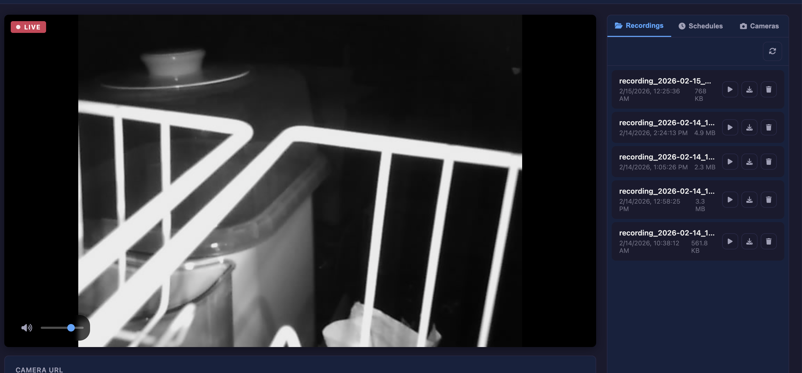
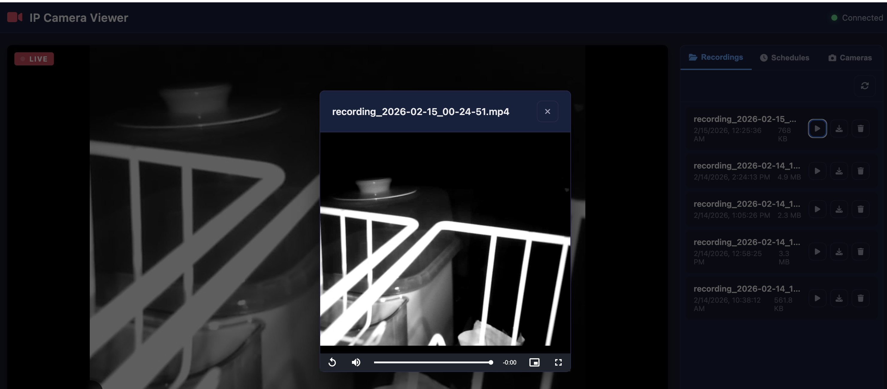

# IP Camera Viewer

A self-hosted web application and macOS desktop app for viewing, recording, and managing IP camera streams. Runs entirely on your local network with zero cloud dependencies.


## Screenshots

### Live Streaming



### Recording Playback



## Features

- **Auto-Discovery** — Finds cameras on your network via ONVIF + port probing with brand fingerprinting
- **Live Streaming** — View MJPEG, RTSP, RTMP, and HTTP camera feeds directly in the browser
- **Recording** — Record camera streams to MP4 with one click, with optional audio capture
- **Audio Denoising** — Real-time FFT-based noise reduction on camera audio (bandpass + noise floor filtering)
- **Scheduled Recording** — Set up recurring recording schedules by day of week and time
- **Multi-Camera Management** — Save and switch between multiple camera configurations
- **Real-Time Status** — WebSocket-based live updates for stream and recording state
- **Recording Playback** — Browse, play, download, and delete recordings from the web UI
- **Health Monitoring** — Automatic detection of unreachable cameras with graceful recovery
- **macOS Desktop App** — Standalone Electron app with App Store and DMG distribution
- **Responsive UI** — Dark-themed interface that works on desktop and mobile

## Prerequisites

- [Node.js](https://nodejs.org/) >= 18
- [FFmpeg](https://ffmpeg.org/) — bundled automatically in the macOS app; needed on PATH for the web server

## Quick Start

### Web Server

```bash
git clone https://github.com/jagatsastry/ip-camera-viewer.git
cd ip-camera-viewer
npm install
npm start
```

Open [http://localhost:3000](http://localhost:3000) in your browser.

### macOS Desktop App

#### Run in development

```bash
npm install
npm run electron
```

#### Build a DMG (one command)

```bash
./scripts/build-macos.sh
```

This runs tests, bundles FFmpeg, and produces a ready-to-install DMG and ZIP in `dist/`. No FFmpeg installation required on the target Mac — it's embedded in the app.

#### Build a notarized DMG (for distribution)

```bash
export APPLE_ID="your@email.com"
export APPLE_ID_PASSWORD="xxxx-xxxx-xxxx-xxxx"   # app-specific password
export APPLE_TEAM_ID="XXXXXXXXXX"

./scripts/build-macos.sh --notarize
```

The notarized DMG can be distributed from your website or GitHub Releases. Users can install it without Gatekeeper warnings.

#### Build for the Mac App Store

```bash
./scripts/build-mas.sh
```

See [App Store Publishing](#app-store-publishing) below for the full checklist.

The desktop app is fully standalone — it embeds the Express server and FFmpeg internally. Just launch the app and it opens a native window. No terminal, no separate server process, no configuration needed. All recordings are saved to `~/Library/Application Support/IP Camera Viewer/recordings/`.

## Usage

1. Enter your camera's address in the URL field (e.g. `admin:password@192.168.1.100`)
2. Select the protocol (Auto, HTTP, RTSP, or RTMP)
3. Click **Start Stream** to begin viewing
4. Use the **Record** button to save footage to disk

### Discovering Cameras

Switch to the **Cameras** tab and click **Scan Network**. The app runs two discovery methods in parallel:

1. **ONVIF Discovery** — WS-Discovery probe for ONVIF-compatible cameras. Automatically fetches the RTSP stream URI when you add the camera.
2. **Port Probe** — Scans your subnet for common camera ports (80, 8080, 554, etc.) and identifies the camera brand by trying known HTTP endpoints from the fingerprint database.

Discovered devices show a badge indicating how they were found (ONVIF or HTTP/RTSP).

### Saving Cameras

Switch to the **Cameras** tab in the sidebar to save camera configurations for quick access. Each saved camera stores its IP, port, credentials, and protocol.

### Scheduled Recording

Switch to the **Schedules** tab to create recurring recording schedules. Configure the camera URL, start time, duration, and which days of the week to record.

## Supported Cameras

The app includes a fingerprint database for automatic detection of these camera brands:

| Brand | MJPEG Path | RTSP Path | Audio | Notes |
|---|---|---|---|---|
| **D-Link** | `/video/mjpg.cgi` | — | `/audio.cgi` | DCS-932LB, DCS-942L. HTTP only on older models. |
| **Axis** | `/axis-cgi/mjpg/video.cgi` | `/axis-media/media.amp` | in RTSP | ONVIF supported on most models. |
| **Foscam** | `/videostream.cgi` | `/videoMain` | `/audiostream.cgi` | FI8910W, FI9821W, C1, R2. |
| **Hikvision** | `/ISAPI/Streaming/.../httpPreview` | `/Streaming/Channels/101` | in RTSP | DS-series. ONVIF supported. |
| **Dahua / Amcrest** | `/cgi-bin/mjpg/video.cgi` | `/cam/realmonitor?channel=1&subtype=0` | in RTSP | Same firmware. ONVIF supported. |
| **Reolink** | — | `/h264Preview_01_main` | in RTSP | RLC series. Primarily RTSP. |
| **TP-Link** | `/stream/video/mjpeg` | `/stream1` | — | Tapo C200, C310. |
| **Wansview** | `/videostream.cgi` | `/11` | — | NCM series. |
| **Tenvis** | `/videostream.cgi` | `/11` | — | Tenvis IP cameras. |
| **Generic** | `/mjpg/video.mjpg`, `/video.mjpg` | `/stream`, `/live` | — | Common budget camera endpoints. |

Any camera that exposes an MJPEG, RTSP, or RTMP stream will work, even if it's not in the fingerprint database. ONVIF-compatible cameras are auto-discovered regardless of brand.

## App Store Publishing

Complete checklist for publishing to the Mac App Store:

### 1. Apple Developer Setup

1. Enroll in the [Apple Developer Program](https://developer.apple.com/programs/) ($99/year)
2. In **Certificates, Identifiers & Profiles**:
   - Create an **App ID**: `com.jagatsastry.ip-camera-viewer`
   - Create a **Mac App Store** distribution certificate ("3rd Party Mac Developer Application")
   - Create a **Mac Installer** certificate ("3rd Party Mac Developer Installer")
   - Create a **Provisioning Profile** for the App ID and download it

### 2. Configure the Project

```bash
# Save provisioning profile to project root
cp ~/Downloads/your_profile.provisionprofile embedded.provisionprofile
```

### 3. Build and Upload

```bash
# Build the MAS package
./scripts/build-mas.sh

# Upload to App Store Connect
xcrun altool --upload-app -f dist/*.pkg --type macos
```

Or use [Transporter](https://apps.apple.com/app/transporter/id1450874784) (Apple's drag-and-drop upload app).

### 4. App Store Connect

1. Go to [App Store Connect](https://appstoreconnect.apple.com)
2. Create a new macOS app with bundle ID `com.jagatsastry.ip-camera-viewer`
3. Fill in the metadata: description, screenshots, privacy policy URL
4. Submit for review

### Sandbox Entitlements

The MAS build requests these entitlements (all required for camera functionality):

| Entitlement | Reason |
|---|---|
| `com.apple.security.app-sandbox` | Required for all MAS apps |
| `com.apple.security.network.client` | Connect to IP cameras on the local network |
| `com.apple.security.network.server` | Internal Express server listens on localhost |
| `com.apple.security.files.user-selected.read-write` | Save recordings to user-chosen location |
| `com.apple.security.cs.allow-jit` | Electron/V8 JIT compilation |

### Direct Distribution (Alternative)

If you prefer to distribute outside the App Store (e.g. from GitHub Releases), build a notarized DMG:

```bash
export APPLE_ID="your@email.com"
export APPLE_ID_PASSWORD="xxxx-xxxx-xxxx-xxxx"
export APPLE_TEAM_ID="XXXXXXXXXX"
./scripts/build-macos.sh --notarize
```

This produces a DMG that any Mac user can install without Gatekeeper warnings. No App Store review required.

## Configuration

Edit `config.json` to customize the web server:

```json
{
  "port": 3000,
  "defaultCameraIp": "192.168.1.100",
  "recordingsDir": "./recordings",
  "streamDir": "./stream",
  "ffmpegPath": "ffmpeg",
  "hlsSegmentDuration": 2,
  "hlsListSize": 5
}
```

| Option | Description | Default |
|---|---|---|
| `port` | Server listen port | `3000` |
| `recordingsDir` | Directory for saved recordings | `./recordings` |
| `streamDir` | Temporary directory for HLS segments | `./stream` |
| `ffmpegPath` | Path to FFmpeg binary | `ffmpeg` |
| `hlsSegmentDuration` | HLS segment length in seconds | `2` |
| `hlsListSize` | Number of HLS segments in playlist | `5` |

> **Note:** The macOS desktop app ignores `recordingsDir` and `streamDir` from config.json. It stores recordings in `~/Library/Application Support/IP Camera Viewer/recordings/` to comply with the macOS sandbox.

## API Reference

### Stream

| Method | Endpoint | Description |
|---|---|---|
| `POST` | `/api/stream/start` | Start streaming from a camera URL |
| `POST` | `/api/stream/stop` | Stop the active stream |
| `GET` | `/api/stream/mjpeg` | MJPEG proxy endpoint (pipe to ``) |
| `GET` | `/api/stream/audio` | Denoised audio proxy (MP3) |
| `GET` | `/api/status` | Get camera and recorder status |

### Recording

| Method | Endpoint | Description |
|---|---|---|
| `POST` | `/api/record/start` | Start recording (body: `{ cameraUrl, includeAudio }`) |
| `POST` | `/api/record/stop` | Stop recording |
| `GET` | `/api/recordings` | List all saved recordings |
| `GET` | `/api/recordings/:filename` | Download a recording |
| `DELETE` | `/api/recordings/:filename` | Delete a recording |

### Schedules

| Method | Endpoint | Description |
|---|---|---|
| `GET` | `/api/schedules` | List all schedules |
| `POST` | `/api/schedules` | Create a schedule |
| `PUT` | `/api/schedules/:id` | Update a schedule |
| `DELETE` | `/api/schedules/:id` | Delete a schedule |

### Cameras

| Method | Endpoint | Description |
|---|---|---|
| `GET` | `/api/cameras` | List saved cameras |
| `POST` | `/api/cameras` | Add a camera |
| `PUT` | `/api/cameras/:id` | Update a camera |
| `DELETE` | `/api/cameras/:id` | Delete a camera |

### Discovery

| Method | Endpoint | Description |
|---|---|---|
| `POST` | `/api/discover` | Scan network (ONVIF + port probe combined) |
| `POST` | `/api/discover/stream-uri` | Get RTSP stream URI from an ONVIF device |
| `POST` | `/api/discover/device-info` | Get device info (manufacturer, model, serial) |

## Architecture

```
ip-camera-viewer/
├── src/
│   ├── server.js          # Express + WebSocket server
│   ├── camera.js          # Stream management (MJPEG proxy, HLS via FFmpeg)
│   ├── recorder.js        # Recording to MP4 (video-only or video+audio)
│   ├── scheduler.js       # Cron-like scheduled recording
│   ├── cameras-store.js   # Camera configuration persistence
│   ├── discovery.js       # ONVIF + port-probe camera discovery
│   ├── fingerprints.js    # Camera brand fingerprint database
│   ├── ffmpeg-path.js     # FFmpeg binary resolution (bundled/static/system)
│   └── routes.js          # REST API endpoints
├── electron/
│   ├── main.js            # Electron macOS app entry point
│   ├── notarize.js        # afterSign notarization hook
│   ├── entitlements.mac.plist       # Entitlements for DMG distribution
│   ├── entitlements.mas.plist       # Entitlements for MAS (sandbox)
│   └── entitlements.mas.inherit.plist # Child process entitlements (FFmpeg)
├── public/
│   ├── index.html         # Single-page application
│   ├── css/style.css      # Dark theme UI
│   └── js/app.js          # Frontend logic
├── scripts/
│   ├── build-macos.sh     # One-command DMG build (with optional notarization)
│   ├── build-mas.sh       # One-command Mac App Store build
│   ├── fake-camera.js     # Multi-brand fake camera server for testing
│   └── fake-camera.sh     # Simple fake camera (bash)
├── config.json            # Application settings
└── tests/
    ├── *.test.js           # Jest unit + integration tests (357 tests)
    └── e2e/                # Playwright Electron E2E tests (139 tests)
```

### How Streaming Works

- **MJPEG cameras** (most common for home IP cameras): The server proxies the raw MJPEG stream directly to the browser via an `` tag. No transcoding required.
- **RTSP/RTMP cameras**: FFmpeg transcodes the stream into HLS segments, served as static files.
- **Audio**: Camera audio is fetched from `/audio.cgi`, passed through FFmpeg's `afftdn` denoiser with a 200Hz-3kHz bandpass filter, and streamed as MP3.

### How Discovery Works

The **Scan Network** button runs two methods in parallel:

1. **ONVIF WS-Discovery** (5s timeout) — Sends a multicast probe. ONVIF cameras respond with their service address. The app then queries each for its RTSP stream URI.
2. **Port Probe** — Scans the local `/24` subnet on common camera ports. For each open HTTP port, it tries all MJPEG paths from the fingerprint database and identifies the camera brand by which endpoint responds.

### How the macOS App Works

The desktop app is a native Electron wrapper around the web server:

1. On launch, the app starts an Express server on a random localhost port
2. A BrowserWindow loads the server's URL — same UI as the web version
3. FFmpeg is bundled inside the app (via `ffmpeg-static`) — no separate install needed
4. Recordings are stored in `~/Library/Application Support/IP Camera Viewer/recordings/`
5. For MAS builds, the app runs inside Apple's sandbox with entitlements for network and file access

## Testing

### Unit & Integration Tests (Jest)

```bash
npm test
```

Covers camera manager, recorder, scheduler, camera store, API routes, frontend DOM, discovery, and fingerprint database. 357 tests across 8 test suites.

### E2E Tests (Playwright + Electron)

```bash
npm run test:e2e
```

139 tests that launch the actual Electron app and interact with every UI element — streaming controls, recording, tabs, modals, schedules, cameras, playback, toasts, WebSocket status, CSS theme, input validation, and full integration flows.

### Fake Camera Server

Test without a real camera using the built-in fake camera server:

```bash
node scripts/fake-camera.js                    # All brands on port 8554
node scripts/fake-camera.js --brand dlink      # D-Link only
node scripts/fake-camera.js --brand hikvision  # Hikvision only
node scripts/fake-camera.js --port 9000        # Custom port
node scripts/fake-camera.js --no-ffmpeg        # Static JPEG mode (no ffmpeg needed)
node scripts/fake-camera.js --list             # List all available brands
```

The fake server serves MJPEG streams, snapshots, and audio endpoints for every camera brand in the fingerprint database. Each stream shows a test pattern with the brand name and live timestamp overlay. Open `http://localhost:8554` in a browser to see all available endpoints.

Then connect from the app:
```
http://localhost:8554    # in the Camera URL field, protocol: HTTP
```

## Privacy

This application runs entirely on your local machine. No data is sent to any external server, cloud service, or third party. All camera streams, recordings, and configuration stay on your network and your disk. There is no telemetry, no analytics, and no phone-home behavior of any kind.

## License

[MIT](LICENSE)
